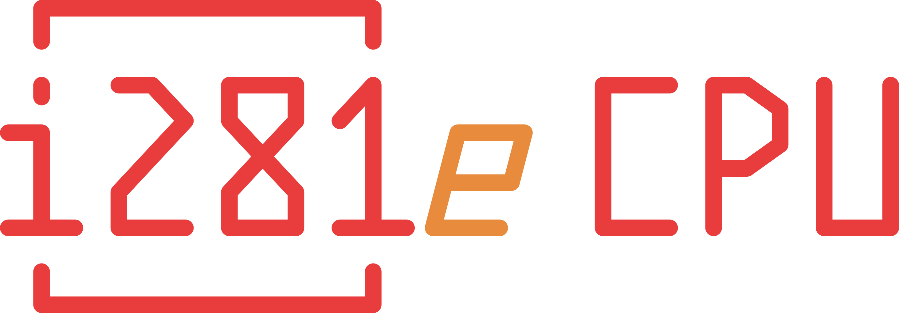

# i281e CPU

Developed by i281e Development Group (formerly SDMAY24-14 Senior Design) under Dr. Alexander Stoytchev, the i281e CPU is an extended design from the original i281 CPU for educational purposes.

Built off the ideas of MIPS processors, the i281e CPU is an 8-bit computer that can execute instructions in a single cycle.  This repository houses all the final materials of the project including KiCAD projects, microcode scripts, and supplemental documentation.

Orignal information regarding the i281e CPU project can be found on the [Senior Design website](https://sdmay24-14.sd.ece.iastate.edu/).

## Who are we?

The i281e Development Group spun off from Iowa State University.  During the 2023-2024 academic year, an Electrical and Computer Engineering (ECpE) Senior Design project was proposed by Dr. Alexander Stoytchev to implement his i281 processor into an independent hardware solution.  This design was improved upon creating the aforementioned i281e CPU.

The members of the i281e Development Group are listed in the included [AUTHORS](./AUTHORS) file.

## Historical Background

In 2018, Dr. Alexander Stoytchev and Kyung-Tae J. Kim began development on a MIPS-based, single cycle processor that could be taught in CPR E 281 (now CPR E 2810) at Iowa State University.  By Summer 2019, a finished implementation of the processor was developed for the [Altera DE2-115 FPGA boards](https://www.terasic.com.tw/cgi-bin/page/archive.pl?Language=English&No=502).  Curriculum was written for the following Fall semester.  During the Fall 2019 semester, the i281 CPU was unveiled to the class to show the culmination of the skills learned throughout the semester.

In Fall 2020, Dr. Stoytchev submitted a project proposal for ECpE Senior Design to develop a [web simulation of the i281 CPU](https://www.ece.iastate.edu/~alexs/classes/i281/index.html).  This simulator would make interacting with the processor significantly easier, especially if Altera boards were inaccessible or otherwise occupied by other students.  A group of six students were formed into sdmay21-38 to develop the web simulator.

| Primary Degree | Member Name
--:|--
| Computer Engineering | Aiman Priester |
|| Eric Marcanio |
|| Bryce Snell |
|| Brady Kolosik |
|| Jacob Betsworth |
| Software Engineering | Colby McKinley |

_Table - Former i281 Web Simulator project members_

The i281 CPU is still taught in CPR E 2810 classes to this day; however, it has a far grander potential waiting to be possessed.  Was it possible to simply produce the i281 CPU into an independent physical device?  In Spring 2022, another Senior Design team (sddec22-20) was formed.  An effort was made to take the original design of the i281 CPU and produce a physical device.  The goal was to make a breadboard version first to ensure logic was correct and sound.

| Primary Degree | Member Name |
--:|--
| Software Engineering | Saffron Edwards |
| Electrical Engineering | Joseph De Jong |
|| Alex Kiefer |
|| Patrick O’Brien |
| Computer Engineering | David Vachlon |

_Table - Former i281 CPU Hardware Implementation members_

Unfortunately, time was not an ally with the previous team and while a breadboard implementation was finished by December 2022, it had some fundamental flaws that hindered it from going further.  This repository and project are where the history continues.

## Attribution

The original i281 CPU design was developed under the MIT License by Kyung-Tae J. Kim and Dr. Alexander Stoytchev.  The hardware and software source files for the original i281 CPU can be found [here](https://www.ece.iastate.edu/~alexs/classes/i281_CPU/) ([https://www.ece.iastate.edu/~alexs/classes/i281_CPU/](https://www.ece.iastate.edu/~alexs/classes/i281_CPU/)).

## Licensing

Hardware, including printed circuit board designs, CAD files, and relevant files, is licensed under [CERN-OHL-P v2](https://cern.ch/cern-ohl).

Logo and relevant components are restricted for use by the i281e Development Group (see [Branding License and Terms](branding/LICENSE)).

All other source files and documentation herein are licensed under MIT License in their respective folders.
